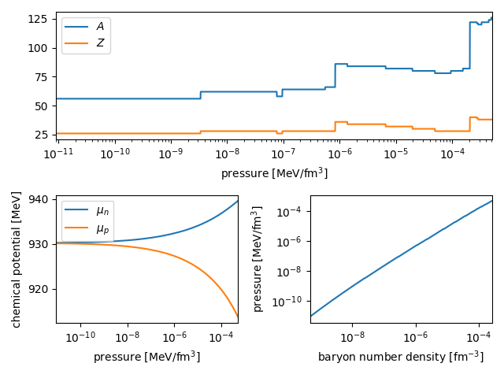

OCoCNANS
========

OCoCNANS (Outer Crust of Cold NonAccreting Neutron Stars) is a Python module 
that can be used to evaluate the ground state of matter in the outer crust of 
cold isolated neutron stars for a given a nuclear mass table.

Requirements
------------

* Python 3

* [NumPy](https://numpy.org/install/)

* [SciPy](https://scipy.org/install.html)

Getting started
---------------

    git clone https://github.com/thomascarreau/OCoCNANS
    cd OCoCNANS

The only two user-facing functions in the module are `ococnans.read_masstable` 
and `ococnans.outer_crust`, and are used like this:

``` py 
import ococnans as oc
hfb26 = oc.read_masstable("masstables/hfb26.data", sep=' ', 
        mexcess=True, useexpdata=True)
ocrust = oc.outer_crust(hfb26, pressure_step=0.003)
```

`ococnans.outer_crust` returns a NumPy array for the ground state of matter in 
the outer crust. Columns are baryon number density in inverse cubic femtometer, 
pressure in MeV per cubic femtometer, neutron chemical potential in MeV, proton 
chemical potential in MeV, mass number of equilibrium nucleus, and charge 
number number of equilibrium nucleus.

The NumPy array can eventually be converted to a pandas DataFrame and 
Matplotlib can be used for visualization.

``` py 
import pandas as pd
ocrust = pd.DataFrame(ocrust, columns=["nb", "pres", "mun", "mup", "aa", "zz"])

import matploblib.pyplot as plt
import matplotlib.gridspec as gridspec
fig = plt.figure(tight_layout=True)
gs = gridspec.GridSpec(2, 2)

ax = fig.add_subplot(gs[0, :])
ax.plot(ocrust.pres, ocrust.aa, label="$A$")
ax.plot(ocrust.pres, ocrust.zz, label="$Z$")
ax.set_xlabel("pressure [MeV/fm$^3$]")
ax.set_xlim(min(ocrust.pres), max(ocrust.pres))
ax.set_xscale("log")
ax.legend(loc='best')

ax = fig.add_subplot(gs[1, 0])
ax.plot(ocrust.pres, ocrust.mun, label="$\mu_n$")
ax.plot(ocrust.pres, ocrust.mup, label="$\mu_p$")
ax.set_xlabel("pressure [MeV/fm$^3$]")
ax.set_ylabel("chemical potential [MeV]")
ax.set_xlim(min(ocrust.pres), max(ocrust.pres))
ax.set_xscale("log")
ax.legend(loc='best')

ax = fig.add_subplot(gs[1, 1])
ax.plot(ocrust.nb, ocrust.pres)
ax.set_xlabel("baryon number density [fm$^{-3}$]")
ax.set_ylabel("pressure [MeV/fm$^3$]")
ax.set_xlim(min(ocrust.nb), max(ocrust.nb))
ax.set_xscale("log")
ax.set_yscale("log")
```



### Mass tables

While the outer layers of the outer crust are solely determined from 
experimental nuclear masses (`masstables/ame2016+welker2017.data`), it is 
necessary to use a mass model to evaluate the composition of the densest 
layers, which consists of very neutron-rich nuclei. Note that you must use 
`useexpdata=True` when running `ococnans.outer_crust` to use experimental data 
instead of the theoretical masses if available.

Any mass model can be used as long as the columns of the corresponding table 
are proton number, neutron number, and either mass excess or nuclear 
mass in MeV (in which case you must use `mexcess=False` when running 
`ococnans.outer_crust`).

The following mass models are available in `masstables/`:

* **ETFSI12** (`etfsi12.data`): Y. Aboussir et al., 
    _At. Data Nucl. Data Tables_ **61** (1995) 127
* **FRDM95** (`frdm95.data`): Moller, P. et al., 
    _At. Data and Nuc. Data Tables_ **59** (1995) 185
* **HFB-14** (`hfb14.data`): S. Goriely, M. Samyn, J.M. Pearson, 
    _Phys. Rev. C_ **75** 064312 (2007)
* **HFB-26** (`hfb26.data`): S. Goriely, N. Chamel, J.M. Pearson, 
    _Phys. Rev. C_ **88** 024308 (2013)
* **KTUY05** (`ktuy05.data`): H. Koura, T.Tachibana, M. Uno, M. Yamada, 
    _Progr. Theor. Phys._ **113** (2005) 305
